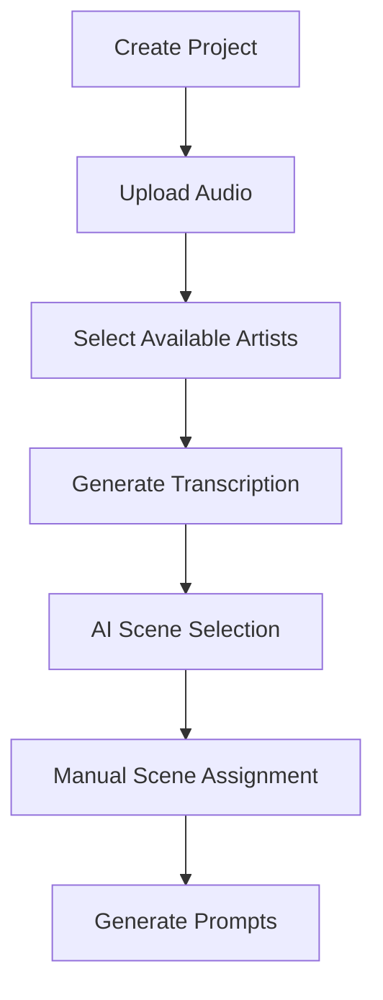
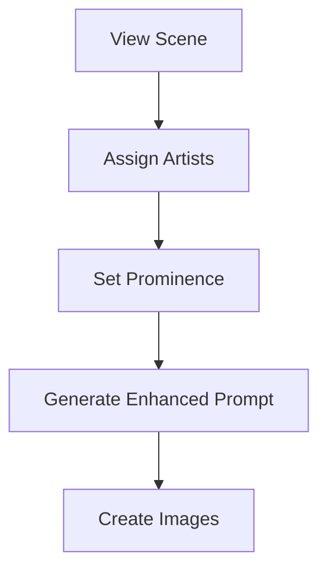

# OMVEE Frontend - Artist Asset Management Integration

## Overview
This specification details the frontend components and workflows needed to integrate the new Artist Asset Management system into the OMVEE music video generation platform.

## API Endpoints Available

### Artist Management
- `POST /api/artists/` - Create artist
- `GET /api/artists/` - List all artists
- `GET /api/artists/{id}` - Get artist details
- `PUT /api/artists/{id}` - Update artist
- `DELETE /api/artists/{id}` - Delete artist

### Image Upload
- `POST /api/artists/{id}/upload-images` - Upload 3-5 reference images
- `GET /api/artists/{id}/presigned-upload` - Get presigned URLs for client-side upload

### Project Integration
- Projects now support: `available_artist_ids`, `selected_reference_images`
- Scenes now support: `featured_artist_ids`, `artist_prominence`

---

## Required UI Components

### 1. Artist Management Page (`/artists`)

**Purpose**: Manage the global artist library

**Layout**:
- Header with "Add New Artist" button
- Grid/list view of existing artists
- Search/filter functionality

**Artist Card Component**:
```typescript
interface ArtistCard {
  artist: {
    id: string;
    name: string;
    description?: string;
    reference_image_urls: string[];
    created_at: string;
  };
  onEdit: (id: string) => void;
  onDelete: (id: string) => void;
  onView: (id: string) => void;
}
```

**Features**:
- Display artist name and description
- Show thumbnail grid of reference images (2x2 layout)
- Edit/Delete action buttons
- Click to view full details

---

### 2. Artist Creation/Edit Modal

**Purpose**: Create new artists or edit existing ones

**Form Fields**:
- **Artist Name** (required, text input)
- **Description** (optional, textarea)
- **Reference Images** (required, 3-5 images)

**Image Upload Component**:
```typescript
interface ImageUpload {
  maxFiles: number; // 5
  minFiles: number; // 3
  acceptedTypes: string[]; // ['image/jpeg', 'image/png', 'image/webp']
  maxFileSize: number; // 10MB
  onUpload: (files: File[]) => Promise<string[]>;
  onRemove: (index: number) => void;
  previews: string[];
}
```

**Features**:
- Drag-and-drop image upload area
- Image preview thumbnails with remove buttons
- Progress indicators during upload
- File validation (type, size, count)
- Support for both direct upload and presigned URLs

**API Integration**:
```typescript
// Create artist
const createArtist = async (data: {
  name: string;
  description?: string;
  images: File[];
}) => {
  // 1. Create artist with placeholder URLs
  const artist = await api.post('/api/artists/', {
    name: data.name,
    description: data.description,
    reference_image_urls: ['temp1', 'temp2', 'temp3'] // Will be replaced
  });

  // 2. Upload images and update artist
  await api.post(`/api/artists/${artist.id}/upload-images`, {
    images: data.images
  });

  return artist;
};
```

---

### 3. Project Creation Updates

**Purpose**: Allow users to select available artists when creating projects

**New Section**: "Available Artists"
- Multi-select component with artist cards
- Search/filter functionality
- Selected artists preview

**Component**:
```typescript
interface ArtistSelector {
  artists: Artist[];
  selectedIds: string[];
  onSelectionChange: (ids: string[]) => void;
  maxSelection?: number;
}
```

**Integration with Project Form**:
```typescript
interface ProjectCreateForm {
  name: string;
  audioFile?: File;
  availableArtistIds: string[]; // NEW
  // ... existing fields
}
```

---

### 4. Scene Management Updates

**Purpose**: Allow assignment of specific artists to individual scenes

**Scene Form Enhancements**:
- **Artist Assignment Section**
- Checkboxes for each available artist (from project)
- Prominence dropdown per artist: "Primary", "Background", "None"

**Component**:
```typescript
interface SceneArtistAssignment {
  availableArtists: Artist[];
  selectedArtists: {
    artistId: string;
    prominence: 'primary' | 'background' | 'none';
  }[];
  onAssignmentChange: (assignments: SceneArtistAssignment[]) => void;
}
```

**Visual Design**:
```
┌─ Artist Assignment ─────────────────────────────────┐
│ ☑ Rio Da Yung OG        [Primary    ▼]            │
│ ☐ Baby Face Ray         [Background ▼]            │
│ ☐ Lil Yachty           [None       ▼]            │
└────────────────────────────────────────────────────┘
```

---

### 5. Artist Reference Display

**Purpose**: Show selected artist reference image in prompts/results

**Component**:
```typescript
interface ArtistReference {
  artist: Artist;
  selectedImageUrl: string; // From project.selected_reference_images
  prominence: 'primary' | 'background' | 'none';
}
```

**Usage**: Display in scene cards, prompt generation results, and image generation status

---

## Workflow Integration

### 1. Project Creation Workflow



**Step 3: Select Available Artists**
- Show artist library
- Allow selection of 1-5 artists
- System randomly selects reference image per artist for this project
- Store selections in `project.available_artist_ids`

### 2. Scene Assignment Workflow



**Step 2-3: Assign Artists & Set Prominence**
- Show available artists (from project selection)
- Allow multiple artists per scene
- Set prominence level for each
- Store in `scene.featured_artist_ids` and `scene.artist_prominence`

### 3. Enhanced Prompt Generation

**Process**:
1. Get scene lyrics and context
2. Get assigned artists and their reference images
3. Call enhanced prompt generation API
4. Display artist-specific prompts

**API Call**:
```typescript
const generateEnhancedPrompt = async (scene: Scene, artistRefs: Record<string, string>) => {
  return await api.post('/api/scenes/generate-prompt-with-artists', {
    scene_id: scene.id,
    artist_reference_images: artistRefs // {artist_id: image_url}
  });
};
```

---

## UI/UX Guidelines

### Visual Design
- **Artist Cards**: Clean, modern design with rounded corners
- **Image Previews**: Consistent aspect ratios, hover effects
- **Upload Areas**: Clear drag-and-drop zones with progress indicators
- **Selection States**: Clear visual feedback for selected/unselected items

### Responsive Design
- **Desktop**: Grid layout for artist cards (3-4 columns)
- **Tablet**: 2-3 columns, larger touch targets
- **Mobile**: Single column, full-width cards

### Error Handling
- **Upload Failures**: Clear error messages with retry options
- **Validation Errors**: Inline validation with helpful messages
- **Network Issues**: Graceful degradation with offline indicators

### Performance
- **Image Optimization**: Automatic resizing/compression before upload
- **Lazy Loading**: Load artist images as needed
- **Caching**: Cache artist data locally
- **Progressive Upload**: Show progress for multi-file uploads

---

## State Management

### Global State (Redux/Zustand)
```typescript
interface ArtistState {
  artists: Artist[];
  loading: boolean;
  error: string | null;
  selectedArtistIds: string[];
}

interface ProjectState {
  currentProject: Project | null;
  availableArtists: Artist[];
  selectedReferenceImages: Record<string, string>;
}
```

### Local Component State
- Form inputs and validation
- Upload progress
- Modal open/close states
- Selection states

---

## Testing Requirements

### Unit Tests
- Artist card rendering
- Form validation
- Image upload component
- Artist selection logic

### Integration Tests
- End-to-end artist creation flow
- Project creation with artist selection
- Scene assignment workflow
- Image upload and validation

### E2E Tests
- Complete user journey from artist creation to video generation
- Multi-artist project scenarios
- Error handling and recovery

---

## Implementation Priority

### Phase 1 (MVP)
1. ✅ Artist management page with basic CRUD
2. ✅ Artist creation modal with image upload
3. ✅ Project creation artist selection
4. ✅ Scene artist assignment

### Phase 2 (Enhanced)
5. Advanced search and filtering
6. Bulk operations (delete multiple artists)
7. Artist analytics and usage stats
8. Advanced image management (reordering, cropping)

### Phase 3 (Future)
9. Auto-detection from lyrics
10. Voice recognition integration
11. Advanced visual consistency tools
12. Performance optimization and caching

---

## API Response Examples

### Artist List Response
```json
{
  "artists": [
    {
      "id": "123e4567-e89b-12d3-a456-426614174000",
      "name": "Rio Da Yung OG",
      "description": "Detroit rapper known for melodic street narratives",
      "reference_image_urls": [
        "https://storage.supabase.com/artists/123/ref_1.jpg",
        "https://storage.supabase.com/artists/123/ref_2.jpg",
        "https://storage.supabase.com/artists/123/ref_3.jpg"
      ],
      "created_at": "2024-09-17T10:30:00Z"
    }
  ],
  "total": 1,
  "limit": 100,
  "offset": 0
}
```

### Upload Response
```json
{
  "message": "Reference images uploaded successfully",
  "artist_id": "123e4567-e89b-12d3-a456-426614174000",
  "uploaded_images": [
    "https://storage.supabase.com/artists/123/ref_1.jpg",
    "https://storage.supabase.com/artists/123/ref_2.jpg",
    "https://storage.supabase.com/artists/123/ref_3.jpg"
  ],
  "image_count": 3
}
```

This specification provides a complete roadmap for frontend integration of the Artist Asset Management system!